### Задание 

- Создать телефонный справочник с возможностью импорта и экспорта данных в нескольких форматах.
- Есть файл, состоящий из N тысяч строк содержащих информацию о неких пользователях.
- Предлагаемые поля: id, имя, фамилия, день рождения, место работы, номер телефона (может быть несколько).
- В качестве символа разделителя использовать пустую строку.

### Пояснения

#### СУБД "Справочник военкомата 2022"
- Система управления базой данных, несуществующей организации ["Справочник военкомата 2022"](main.py). Вся информация в данной СУБД (СНИЛС, ФИО, Телефоны и др.) генерируются автоматически и не содержит персональных данных.

- СУБД позволяет:

1. Создать базу
2. Удалить базу
3. Добавить запись
4. Удалить запись
5. Найти записи
6. Экспортировать в HTML
7. Экспортировать в XML
8. Экспортировать в CSV
9. Выводить результаты поиска на экран

 ### 1. Создать базу
- При первом запуске СУБД, либо при удаленной БД, отобразится сообщение "Нет базы!!!"
- 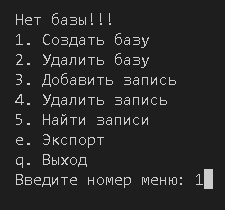
- После ввода "1" кода пункта меню "Создать базу, отобразиться следующее окно:
- 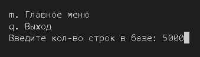
- После ввода желаемого количества строк, СУБД сгенерирует БД:
- 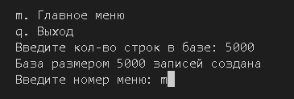
- Для возврат в главное меню нажимает "m".

### 2. Удалить базу
- Для удаления БД в главном меню вводим номер "2":
- 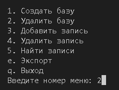
- Для подтверждения удаления необходимо нажать прописную "Y":
- 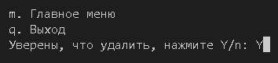
- После удаления БД, возвращаемся в главное меню "m":
- 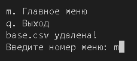

### 3. Добавить запись
- В главном меню выбираем номер "3":
- 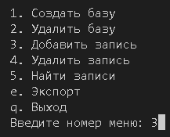
- Откроется подменю, для добавления записи необходимо заполнить все поля, выбирая соответствующую букву, например, для СНИЛС это "i":
- 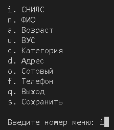
- После ввода значения полей информация будет отображаться внизу экрана, над строкой ввода номера меню:
- 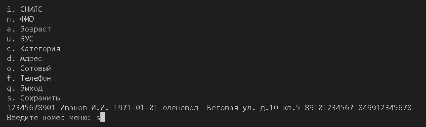
- Для сохранения введенных значений в БД, необходимо сохранить/добавить запись, введя "s":
- 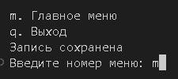
- Для возврата в главное меню используем "m".

### 4. Удалить запись
- В главном меню выбираем номер меню "4":
- 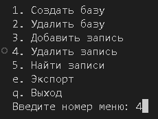
- В открывшемся подменю заполняем все поля, путем ввода литеры соответствующего пункта меню, например для СНИЛС "i":
- 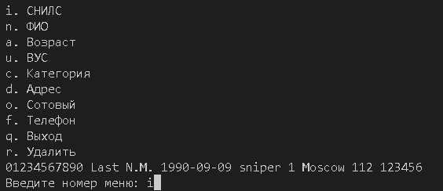
- После заполнения желаемых полей, для удаления записи или нескольких записей, в случае заполнения не всех полей, вводим "r":
- 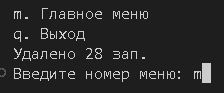
- В отображенном подменю указано количество удаленных записей, соответствующих заданным критериям. Для возврата в главное меню нажимаем "m".

### 5. Найти записи
- В главном меню вводим номер "5":
- 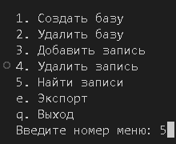
- В открывшемся подменю заполняем все поля с помощью соответствующих литер, например для ВУС это "u", для Категории "c". При заполнении полей, значения будут отображаться внизу экрана, над строкой ввода номера меню.
- Для запуска поиска нажимаем "s":
- 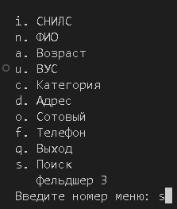
- В результате поиска откроется подменю с возможностью экспорта результатов поиска в 3 формата, либо вывод результатов на экран.
Внизу экрана, над строкой ввода номера записи отобразится количество найденных записей.
- 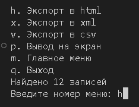

### 6. Экспортировать в HTML
- После осуществления поиска (см. пункт 5. Найти запись) откроется подменю экспорта. Результаты последнего поиска сохраняются в памяти программы, что позволяет перемещаться по уровням меню. Так из главного меню при нажатии литеры "e" попадаем в меню экспорта, и при ранее осуществленном поиске, о количестве найденных записей сообщает надпись "Найдено записей".
- Для экспорта в файл формата HTML вводим "h" в поле ввода номера, подменю экспорта:
- 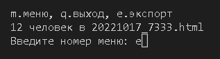
- Данное окно сообщает о количестве экспортируемых строк и название сохраненного файла в корневом каталоге программы:
- 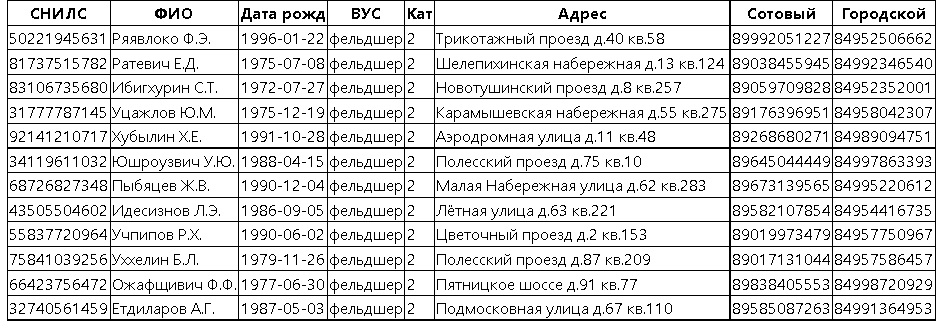
- Для возврата в окно экспорта вводим "e". Для возврата в главное меню вводим "m".

### 7. Экспортировать в XML
- Из меню поиска (см.пункт 5.Найти запись). Либо при сохраненном запросе из главного меню нажимаем "e", для отрытия окна экспорта, в котором выбираем "x" для экспорта в формат XML:
- 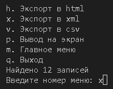
- В результате экспорта отобразится окно с результатом и именем сохраненного файла xml:
- 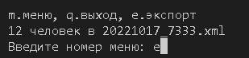
- Для возврата в окно экспорта вводим "e". Для возврата в главное меню вводим "m".

### 8. Экспортировать в CSV
- Из меню поиска (см.пункт 5.Найти запись). Либо при сохраненном запросе из главного меню нажимаем "e", для отрытия окна экспорта, в котором выбираем "v" для экспорта в формат CSV:
- 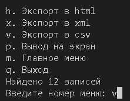
- В результате экспорта отобразится окно с результатом и именем сохраненного файла xml:
- 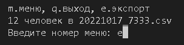
- Для возврата в окно экспорта вводим "e". Для возврата в главное меню вводим "m".

### 9. Выводить результаты поиска на экран
- Из меню поиска (см.пункт 5.Найти запись). Либо при сохраненном запросе из главного меню нажимаем "e", для отрытия окна экспорта, в котором выбираем "p" для вывода записей на экран:
- 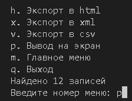
- В результате на экран терминал будут выведены ранее найденные записи:
- 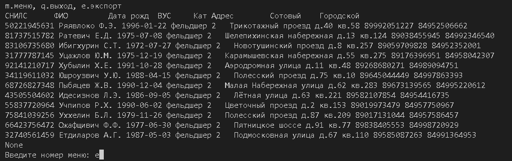
- Для возврата в окно экспорта вводим "e". Для возврата в главное меню вводим "m".